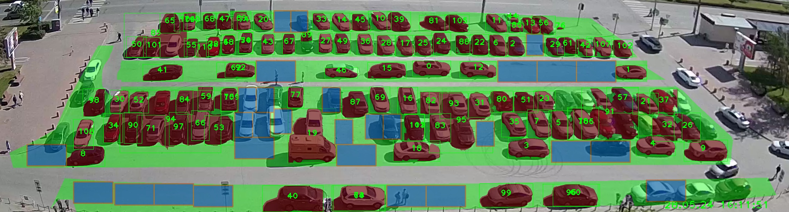

# SUSU_parking
Project for count parking at SUSU. 
1. Get image frome camera Intersvyaz.
2. Calibrate camera image.
3. Cut frame on video.
4. Detection cars.
5. Segmantation free space
6. Find and draw boxes for new cars.

